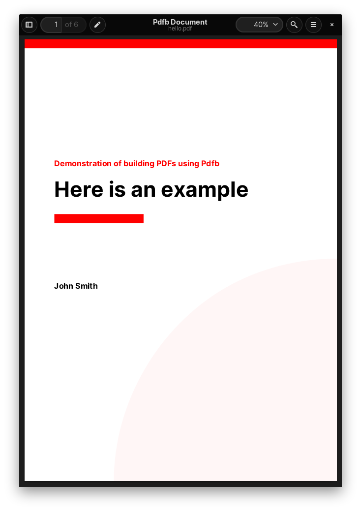
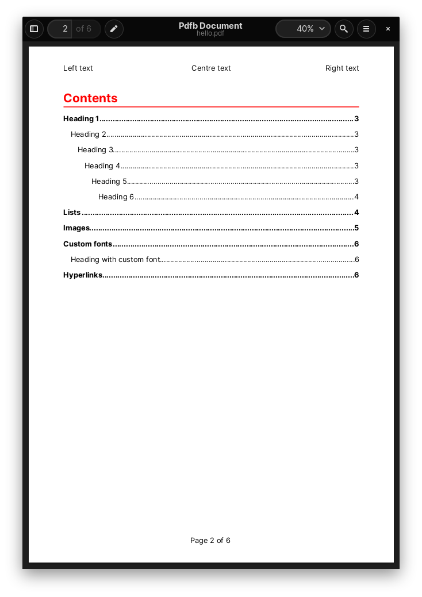
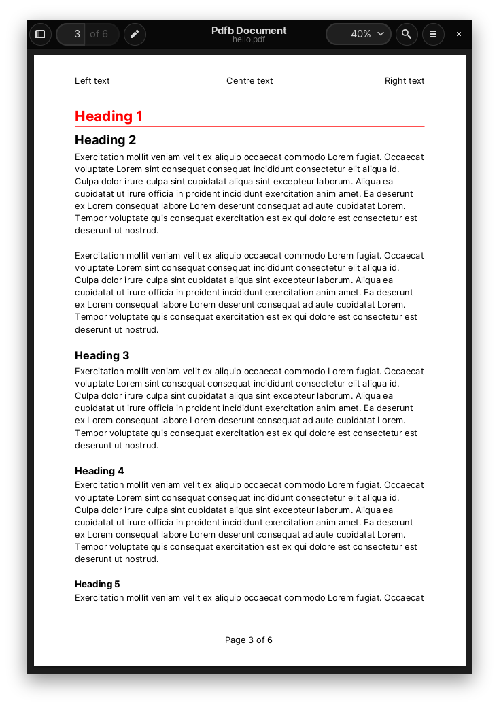

# pdfb

**Work in progress**

A PDF document builder utilising the fantastic [gofpdf](https://github.com/jung-kurt/gofpdf) package by Kurt Jung.

PDFB uses gofpdf to provide a number of useful methods for creating fully complete, featureful, and professional PDF documents easily. 

Features:
- Table of contents
- Heading levels
- Paragraphs
- Bulleted and numbered nested lists
- Accent colours
- Drawing shapes (boxes, circles, lines)
- Headers and Footers
- Tables
- Page background
- Images and image filtering using [gift](https://github.com/disintegration/gift) (crop, flip, rotate, colour balance, grayscale, hue, saturation, blur, pixelation, and much more)
- Hyperlinks
- Export in base64 encoding

